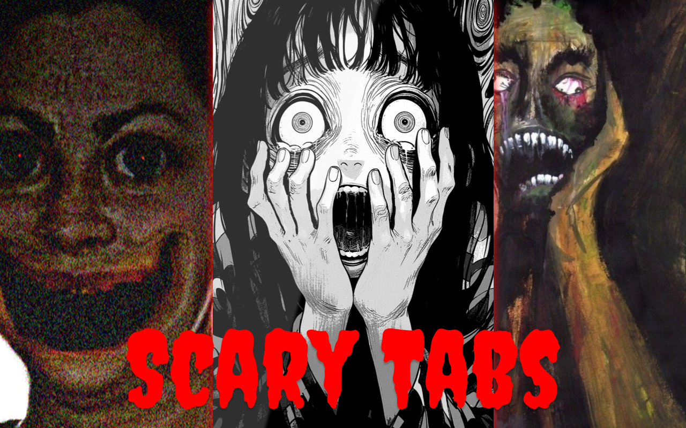

Scary Tabs is a browser extension that scares you after few moments when you open a tab, 
to social media sites, or other user specified sites.



# Extension Store

- [Chrome](https://chromewebstore.google.com/detail/scarytabs/agnfkibbaokacgdlfmpjnjgbfhabmnoo?hl=en-US&authuser=1)


## Development

```bash
; yarn dev:chrome # you will need to open chrome://extensions/ and load the extension
; yarn dev:firefox
; yarn build:chrome
; yarn build:firefox
```

## Build

```bash
; yarn build:chrome
; yarn build:firefox

# to build a zip file for chrome
; zip -r my-extension.zip dist_chrome -x "dist_chrome/*.DS_Store" 
```
